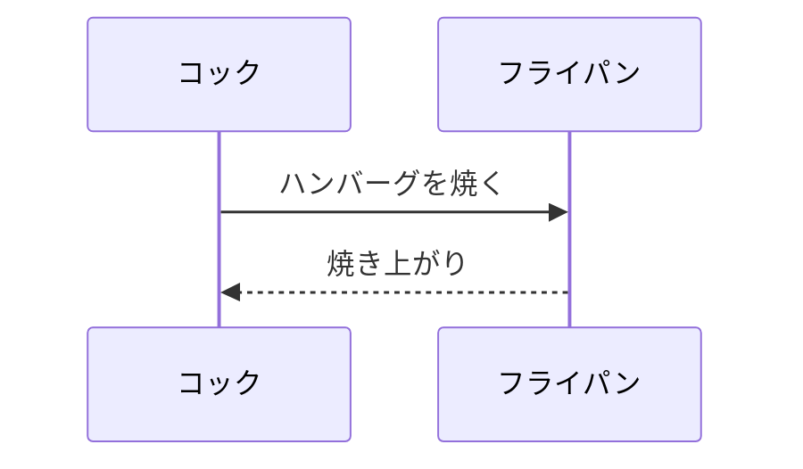

# bpmchat


ここに書いて多くか
- GSS 用チャットシステムの提供

- GASでAPI開発
- CHROMEEXTENTION
- 画面開発　小さいコンポーネント
- GASシステム　コマンドで実行
- GSS連携　GSS用WEB画面設定　GSSのシート登録のナビゲート
- 画面設定（登録）GSS用カスタマイズ画面の提供


- 使用方法　（申し込み）
- URLを送ります→GSSに設定
- IOS,ANDROID提供（画面設定）
- 


業務設計から　開発ナビゲートまで

https://www.google.com/search?q=github+%E6%A4%9C%E7%B4%A2%E6%96%B9%E6%B3%95&rlz=1C1AGAK_jaJP963JP963&oq=github+%E6%A4%9C%E7%B4%A2%E6%96%B9%E6%B3%95&aqs=chrome..69i57j69i64.9856j0j7&sourceid=chrome&ie=UTF-8

流れ

そこから先はそれぞれの開発

→それぞれの業務毎に　業務サポートと専用チャットをつける

→いろいろな技術に凝らなく　シンプルにカスタマイズできるもの

bpmchatproject

メモ代わりでいいや

うーむ　これチャットに組み込めないないかなー

開発　
　→チャット　GIT　
 →ドライブ
 
 　→Colab
  　→GAS
   
   Lara el
   Django
   
   やること
   ーーーーーーーーーーーーーーーーーーーーーーーーーーーーーーーーーーーーーーーーーーーーーーーーーーーーーーーーーーー
   
   ```mermaid
sequenceDiagram
participant cook as コック
participant kitchenware1 as フライパン
    cook ->> kitchenware1: ハンバーグを焼く
    kitchenware1 -->> cook : 焼き上がり

```
   
   
   


